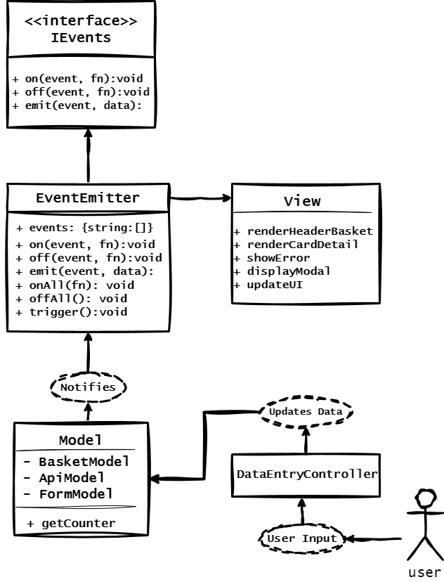

# WEB-ларёк

## Описание проекта

**WEB-ларёк** — это одностраничный интернет-магазин, предлагающий товары для разработчиков. Пользователи могут просматривать каталог товаров, добавлять их в корзину, а затем оформлять заказ через удобную форму с несколькими шагами.

------------

## Используемый стек

-  TypeScript
-  JavaScript 
-  Webpack 
-  HTML 
-  SCSS 

------------

## Установка и запуск

**Для установки и запуска проекта**

```
npm install
npm run start

```

или

```
yarn
yarn start

```

## Сборка

```
npm run build

```

или

```
yarn build

```

------------
## Описание функционала магазина

 **1. Элементы пользовательского интерфейса**

 **Главный экран:**
 - Логотип и название магазина.
- Навигационное меню в котором только одна кнопка - "**Корзина**"
- Список товаров с изображениями, названиями, ценами.

**Карточка товара:**
- Изображение товара.
- Полное описание (*особенности, характеристики*).
- Цена.
- Кнопка "**Купить**".

**Корзина:**
- Список выбранных товаров с названиями, ценами.
- Возможность удалять товары.
- Общая сумма заказа.
- Кнопка "**Оформить**".

**Форма заказа:**
- Выбор способа оплаты (*онлайн или при получении*).
- Поле для ввода адреса доставки.
- Кнопка "**Далее**".
- После нажатия на кнопку "**Далее**" - Поля для ввода контактных данных (*email, номер телефона*).
- Кнопка оплатить.

**Модальные окна:**
- Окно карточки с товаром, полным описанием, ценой и кнопкой "**Купить**".
- Окно корзины со списком выбранных товаров с названиями, ценами, общей суммой заказа и кнопкой "**Оформить**".
- Окно со способом оплаты (*онлайн\при получении*), вводом адреса доставки и кнопкой "**Далее**".
- Окно с вводом контактной информации (*email\телефон*) и кнопкой "**Оплатить**".
- Окно с изображением галочки, информацией о том, что заказ оформлен, с информацией о том, сколько списано валюты и кнопкой "**За новыми покупками!**".
 
 **2. Как пользователь взаимодействует с приложением**
 
 - Пользователь заходит на главную страницу, просматривает товары.
- Нажимает на карточку товара, чтобы узнать больше, и добавляет товар в корзину нажимая кнопку "**Купить**", при нажатии на кнопку "**Купить**" модальное окно закрывается и пользователь дальше просматривает товары.
- Пользователь, после выбора товаров, открывает корзину, проверяет содержимое и при необходимости вносит изменения (*можно только удалить товар, либо продолжить оформление, либо закрыть модальное окно с корзиной и вернуться к выбору товаров*).
- Заполняет форму заказа - сначала выбирает способ оплаты и вводит адрес доставки, затем после нажатия на кнопку "**Далее**" вводит контактные данные (*номер телефона и email*) и нажимает кнопку "**Оплатить**".

**3. Процесс оформления заказа**

**Добавление товара в корзину:**

- Пользователь нажимает на карточку товара, чтобы узнать больше, и добавляет товар в корзину нажимая кнопку "**Купить**".

**Просмотр корзины:**
- Пользователь, после выбора товаров, открывает корзину, проверяет содержимое и при необходимости вносит изменения (*можно только удалить товар, либо продолжить оформление, либо закрыть модальное окно с корзиной и вернуться к выбору товаров*).

**Заполнение формы заказа:**
- Из корзины пользователь при нажатии на кнопку "**Оформить**" переходит к форме заказа - сначала выбирает способ оплаты и вводит адрес доставки, затем после нажатия на кнопку "**Далее**" вводит контактные данные (*номер телефона и email*) и нажимает кнопку "**Оплатить**".

- В случае ошибок при вводе адреса кнопка "**Далее**" становится неактивной с текстом, рядом с кнопкой - "**Адрес некорректный**".

- В случае ошибок при вводе контактной информации (*email, номер телефона*) кнопка "**Оплатить**" становится неактивной с соответствующим текстом "**Некорректный номер телефона; Некорректный адрес электронной почты**"

### Принцип работы
Проект будет построен на паттерне **MVP**, где каждый компонент системы будет выполнять четко разделенную роль:

-   **Model** — занимается обработкой данных, включая взаимодействие с сервером и хранение данных от пользователя.
-   **View** — отвечает за отображение UI и взаимодействие с пользователем.
-   **Presenter** — его роль выполняет **EventEmitter**, управляющий событиями и связью между **Model** и **View**.

----------

### 1. **Модели данных (Model)**

#### 1.1 **Api**

**Api** — это базовый класс для взаимодействия с сервером, он управляет запросами **GET** и **POST**, а также обрабатывает ошибки, возвращаемые сервером.

**Методы**:

-   `get(uri: string): Promise<object>`: Выполняет запрос **GET** для получения данных с сервера.
-   `post(uri: string, data: object, method: ApiPostMethods = 'POST'): Promise<object>`: Выполняет запрос **POST** для отправки данных на сервер.

**Основные операции**:

-   Получение данных с сервера.
-   Отправка данных на сервер.

----------

#### 1.2 **ApiModel**

**ApiModel** — это модель, которая наследует класс `Api` и предоставляет методы для работы с товарами и заказами.

**Методы**:

-   `getListProductCard(): Promise<Product[]>`: Получает список продуктов с сервера.
-   `postOrderLot(order: Order): Promise<any>`: Отправляет заказ на сервер.

**Основные операции**:

-   Взаимодействие с сервером для получения данных о товарах.
-   Отправка данных о заказе.

----------

#### 1.3 **BasketModel**

**BasketModel** — это модель для работы с данными корзины. Она хранит товары, добавленные в корзину, и предоставляет методы для управления этими данными.

**Методы**:

-   `getCounter(): number`: Возвращает количество товаров в корзине.
-   `getSumAllProducts(): number`: Возвращает общую стоимость всех товаров в корзине.
-   `setSelectedCard(product: CartProduct): void`: Добавляет товар в корзину.
-   `deleteCardToBasket(productId: string): void`: Удаляет товар из корзины.
-   `clearBasketProducts(): void`: Очищает корзину.

**Основные операции**:

-   Управление списком товаров в корзине.
-   Получение данных о количестве товаров и их общей стоимости.

----------

#### 1.4 **FormModel**

**FormModel** — это модель для работы с данными, полученными от пользователя. Она включает методы для сохранения и валидации контактной информации и адреса доставки, а также для формирования данных о заказе.

**Методы**:

-   `setOrderAddress(address: string): void`: Сохраняет адрес пользователя.
-   `validateOrder(): boolean`: Проверяет правильность введенного адреса.
-   `setOrderData(contact: { email: string, phone: string }): void`: Сохраняет контактные данные.
-   `validateContacts(): boolean`: Проверяет валидность контактных данных.
-   `getOrderLot(): Order`: Возвращает данные о заказе.

**Основные операции**:

-   Сбор данных пользователя, включая адрес и контактную информацию.
-   Валидация введенных данных.

----------

### 2. **Компоненты View**

#### 2.1 **Card**

**Card** — это компонент для отображения карточки товара и управления отображением информации о товаре, такой как его название, **описание** и **цена**.

**Методы**:

-   `setText(text: string): void`: Обновляет текстовое содержимое карточки товара.
-   `setPrice(price: number): void`: Обновляет цену товара, отображая её в нужном формате.

**Поля**:

-   `element: HTMLElement`: Элемент DOM, который используется для отображения карточки товара.

**Основные операции**:

-   Отображение информации о товаре в карточке.
-   Обновление данных карточки при изменении информации.

----------

#### 2.2 **Basket**

**Basket** — это компонент для отображения корзины. Он взаимодействует с моделью корзины (`BasketModel`) и отображает текущее состояние корзины, включая количество товаров и их общую стоимость.

**Методы**:

-   `renderHeaderBasketCounter(): void`: Отображает количество товаров в корзине.
-   `renderSumAllProducts(): void`: Отображает общую стоимость всех товаров в корзине.

**Поля**:

-   `basketModel: BasketModel`: Экземпляр модели корзины, из которой компонент получает данные.

**Основные операции**:

-   Отображение данных о корзине пользователю.
-   Обновление количества товаров и суммы при изменении содержимого корзины.

----------

### 3. **EventEmitter (Presenter)**

**EventEmitter** — это класс для работы с событиями, который связывает Model и View. Он позволяет подписываться на события, отписываться от них и генерировать события с передачей данных.

**Методы**:

-   `on(event: string, listener: Function): void`: Подписка на событие.
-   `off(event: string, listener: Function): void`: Отписка от события.
-   `emit(event: string, data: any): void`: Генерация события.
-   `onAll(listener: Function): void`: Подписка на все события.
-   `offAll(): void`: Сброс всех подписок.
-   `trigger(event: string, ...args: any[]): void`: Триггер события с передачей данных.

**Основные операции**:

-   Управление подписками на события.
-   Генерация событий и вызов всех слушателей.


----------

### 4. **Взаимодействие**

**EventEmitter** будет уведомлять **View** о событиях, таких как добавление товара в корзину или отправка заказа.

-   Когда **View** (*например, корзина*) изменяет количество товаров, **EventEmitter** передает уведомление о событии, а **Presenter** обновляет **Model** и **View**.
-   Например, при изменении корзины, **Presenter** обновляет данные корзины в **Model** и вызывает методы для обновления UI в **View**.

----------

### Пример сценария:

1.  **Пользователь добавляет товар в корзину**:
    
    -   **View** вызывает метод `setSelectedCard` из **BasketModel**, чтобы добавить товар в корзину.
    -   **BasketModel** обновляет данные, а **EventEmitter** сообщает **View** обновления.
2.  **Пользователь оформляет заказ**:
    
    -   **View** вызывает методы `setOrderData` и `validateOrder` в **FormModel** для проверки данных.
    -   Если данные валидны, **FormModel** передает заказ в **ApiModel**, который отправляет данные на сервер.
    -   **EventEmitter** уведомляет **View** о результатах, отображая успешное сообщение или ошибку.

----------

## UML схема



### 1. **User Input**

-  Пользователь взаимодействует с интерфейсом, например, выбирает товар, добавляет его в корзину, или заполняет форму заказа.
-  Ввод данных передается в **DataEntryController**, который занимается логикой обработки пользовательских действий.
### 2. **DataEntryController**
-  Этот контроллер принимает данные от пользователя и организует дальнейшую обработку(*например, добавление товара в корзину или введение адреса*).
- Контроллер передает информацию в **Model**, чтобы обновить состояние приложения, например, добавление товара в корзину или отправка данных заказа.

### 3. **Model**

-  Это центральные компоненты, которые управляют данными и выполняют бизнес-логику:
    
    -   **BasketModel**: управляет товарами в корзине (*добавление, удаление, подсчет количества и стоимости*).
    -   **ApiModel**: взаимодействует с сервером для получения списка товаров и отправки заказов.
    -   **FormModel**: обрабатывает данные формы, такие как адрес и контактные данные пользователя, выполняет валидацию.
-  Модели обновляют данные (*например, количество товаров в корзине или информацию о заказе*).
    

### 4. **Notifies**

-  После обновления данных в моделях, происходит уведомление о изменении данных через **EventEmitter**. Он сигнализирует, что данные изменились, и необходимо обновить интерфейс.

### 5. **EventEmitter**

-  Это компонент, который отвечает за отправку уведомлений между **Model** и **View**. EventEmitter управляет событиями (*например, "товар добавлен в корзину", "заказ оформлен"*) и уведомляет другие компоненты о том, что нужно обновить интерфейс.
-   **Что он делает**:
    -   **on(event, fn)**: Подписывается на событие.
    -   **off(event, fn)**: Отписывается от события.
    -   **emit(event, data)**: Генерирует событие и передает данные.
    -   **trigger()**: Запускает событие.
-   Когда данные обновляются в моделях, **EventEmitter** уведомляет о событии **View** для того, чтобы обновить интерфейс.

### 6. **View**

-  **View** отвечает за отображение данных на экране. Когда **EventEmitter** сообщает о событии - **View** обновляет интерфейс:
    
    -   **renderHeaderBasket**: обновляет отображение количества товаров в корзине.
    -   **renderCardDetail**: отображает детали товара.
    -   **showError**: отображает ошибки (*некорректный email или телефон и т.п.*).
    -   **displayModal**: показывает модальные окна (*форма оформления заказа и т.п.*).
    -   **updateUI**: обновляет интерфейс в зависимости от событий (*при изменении корзины или успешном оформлении заказа и т.п.*).
-  **Viev** получает данные от **Model** через уведомления от **EventEmitter** и обновляет интерфейс для пользователя.
    

### 7. **Интерфейс событий**

- Интерфейс **IEvents** описывает контракт, который должен быть реализован **EventEmitter**. Он включает методы для подписки на события и их генерации.
-  Он обеспечивает возможность регистрации событий и уведомлений о них, позволяя **Presenter** ( **EventEmitter**) взаимодействовать с **Model** и **View**.